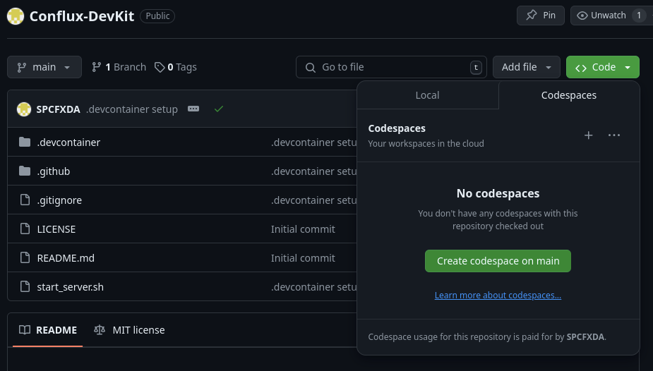
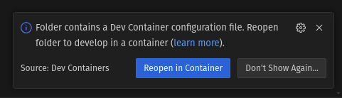
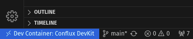

# Conflux DevKit

## Overview

Conflux DevKit provides an easy-to-setup development environment for the Conflux blockchain spaces (Core Space and ESpace EVM). It leverages Docker to create a devcontainer with all necessary tools, dependencies, and configurations pre-installed, ensuring a seamless and consistent development experience.

This repository is a minimal setup and will be used for the creation of more task-specific repositories like a Hardhat-conflux repository or a frontend template repository.

## Features

- Pre-configured development environment for Conflux Core Space and ESpace.
- Simplified setup with all dependencies installed.
- Consistent and isolated development environment.
- Integrated OpenVSCode server for a web-based development experience.
- Compatibility with GitHub Codespaces and VS Code's devcontainer feature.

## What is available in this dev environment

Using the following [Dockerfile](.devcontainer/conflux/Dockerfile) and [develop.toml](.devcontainer/conflux/develop.toml), the Docker instance will create an [independent chain](https://doc.confluxnetwork.org/docs/general/run-a-node/advanced-topics/running-independent-chain).
The `independent chain` will be reachable with the following RPC that can be added to [Fluent](https://fluentwallet.com/) or [Metamask](https://metamask.io/) wallet:

Core:  http://localhost:12537

Espace: http://localhost:8545

During the build of the image, the node binary will be installed in the `/opt/conflux/` folder and some genesis account private keys will be created using the following script: [genesis_secrets.js](.devcontainer/conflux/utils/genesis_secrets.js)

The genesis account can be found in `/opt/conflux/genesis_secrets.txt`. You can import these accounts into your wallet, or you can add your development private key to this file before starting the Conflux node.

To start the `independent chain`, open the terminal in the VS Code interface (this is the same for the locally installed VS Code or the web-based one in Codespaces or OpenVSCode-Server) and use this command:

```sh
start_dev_node
```

`start_dev_node` is a shell script located in `/usr/bin/start_dev_node` with the following content:

```sh
#!/bin/bash
ulimit -n 10000
export RUST_BACKTRACE=1
/opt/conflux/conflux --config /opt/conflux/develop.toml
```

Once the `independent chain` is running you can open another terminal and transfer funds from the genesis Core addresses to their ESpace addresses with the following command:
```sh
genesis_espace
```

this command execute the [genesis_espace](.devcontainer/conflux/utils/genesis_espace.js)  script that read the genesis private keys and use them to call the [crossSpaceCall](https://doc.confluxnetwork.org/docs/core/core-space-basics/internal-contracts/crossSpaceCall) internal contract

## Getting Started
### Prerequisites

- Docker installed on your machine (if used locally).

### Run in GitHub Codespaces

You can open this repository in Codespaces using the Codespaces tab under the `CODE` button:



After a few seconds, the environment will be ready to use.

### Run in VS Code devcontainer

After you open the repository folder with VS Code, the following popup will appear in the bottom right corner:



Click on the `Reopen in Container` button, and after the build and download of the layers are completed, your instance of VS Code will be inside the devcontainer. You can confirm this from the status in the bottom left corner that should look like this:



### Run the Docker Container with OpenVSCode Server

1. Clone the repository:

    ```sh
    git clone https://github.com/your-repo/conflux-devkit.git
    cd conflux-devkit
    ```

2. To start the container with the Conflux node and OpenVSCode server, you can use the `start_server.sh` in the root of the repository:
    ```sh
    ./start_server.sh
    ```
    The content of the script will build and run the Docker instance. This is the content of the shell script for reference:

    ```sh
    #!/bin/bash
    docker build .devcontainer/conflux --tag "conflux-devkit-server"
    docker run -it -p 5000:5000 -p 12537:12537 -p 8545:8545 -v "$(pwd):/workspaces:cached" -d conflux-devkit-server --name conflux-devkit-server
    ```

### Access the OpenVSCode Server

Open your browser and navigate to `http://localhost:5000` to access the OpenVSCode server.

## Configuration

### Environment Variables

- `NODE_VERSION`: Specifies the version of Conflux Node to use (default is `2.3.5`).
- `SERVER_VERSION`: Specifies the version of OpenVSCode server to use (default is `1.90.0`).

### Ports

- `3000`: Default port for Node application.
- `12535`: Core WebSocket RPC.
- `12537`: Core HTTP RPC (Endpoint port for Fluent wallet).
- `8545`: ESpace HTTP RPC (Endpoint port for Fluent/MetaMask wallet).
- `8546`: ESpace WebSocket RPC.
- `5000`: Port for OpenVSCode server.

## Advanced Usage

### Custom User

To enable the creation of a custom user, uncomment the following lines in the [Dockerfile](.devcontainer/conflux/Dockerfile):

```Dockerfile
RUN groupadd --gid $USER_GID $USERNAME \
    && useradd --uid $USER_UID --gid $USERNAME -m -s /bin/bash $USERNAME
```

Ensure to set the correct `USERNAME`, `USER_UID`, and `USER_GID` values.

### Passwordless Sudo

Passwordless sudo is configured for the user specified by `USERNAME`. This allows the user to execute commands with root privileges without entering a password.

## Contributing

Contributions are welcome! Please fork the repository and submit a pull request for any changes.

## License

This project is licensed under the MIT License. See the [LICENSE](LICENSE) file for details.

## Acknowledgements

- [Conflux](https://confluxnetwork.org/)
- [Fluent](https://fluentwallet.com/)
- [OpenVSCode Server](https://github.com/gitpod-io/openvscode-server)

For more information, visit the [official documentation](https://doc.confluxnetwork.org/).
